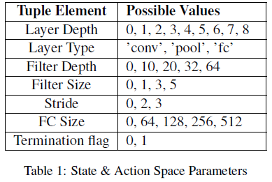
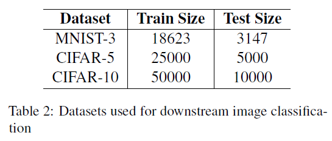
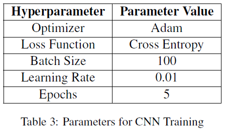
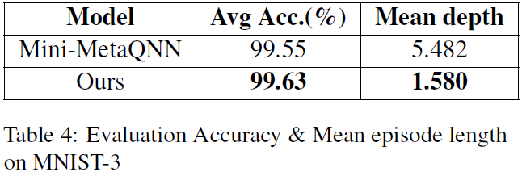

# Building Neural Networks using Deep Reinforcement Learning

### Contributors
- `Eshwar Prasad Sivaramakrishnan`: esivaram@usc.edu
- `Aditya Srivastava`: adityasr@usc.edu
- `Swarali Atul Joshi`: swaralia@usc.edu
- `Abhiruchi Bhattacharya`: abhiruch@usc.edu

# Introduction

This work is built to automate the design process for neural networks using reinforcement learning. Adopting prior design strategies and Deep Reinforcement Learning (DRL) techniques, we solve the MDP of constructing CNNs. Further, we use reward-shaping techniques to penalize large model sizes in order to urge agents to choose less complex CNNs without compromising on validation accuracy.

# Methodology

CNN as a Markovian Decision Process
We adopt the MDP representation for CNNs proposed
in [MetaQNN](https://bowenbaker.github.io/metaqnn/) (Baker et al., 2017) and adapt
it to fit our computation restrictions.

### The State Space
Each state in the MDP is a single layer represented
as a tuple with information about layer type, its
depth in the network and its associated hyperparameters.
Although the formulation is extensible
to all types of layers, we restrict our experiments
to convolution (’conv’), pooling (’pool’) and fully
connected (’fc’) layers.

### The Action Space
Actions are represented as similar tuples to states,
encapsulating information about the next layer to
be added. We manipulate the action space to restrict
possible actions from a given state to ensure
that sampled trajectories are always valid networks.

### Rewards
We consider two types of rewards to optimize for,
on reaching the terminal state:

  1. Accuracy: The CNN architecture represented
by the agent’s trajectory is trained on an image
classification problem and the validation accuracy
of this procedure is given to the agent
as terminal reward.

  2. Model Size Based Penalty: We also propose a minor
penalty to be deducted from the accuracy.
Penalty P for a given model with x trainable
parameters is calculated as:
P = β(δ · x + log(x))
where δ is a small constant (e−8) which preserves
linearity and β is a scale parameter,
normalizing the penalty to the same scale as
accuracy.

# Experimental Setup
### Dataset

To put into context our choice of datasets, it is noteworthy
to mention that the training of our RL agent
involves training several thousand CNNs. This restricts
the scope of our experiments, mainly due to
computation limitations.

### MDP Implementation
The CNN-MDP environment is designed with [OpenAI
Gym](https://www.gymlibrary.dev/) (Brockman et al., 2016). The states and
actions in the environment are designed as a tuple
of 7 discrete dimensions, as described in Table 1.
The environment uses invalid action masking to
present a binary mask (with 1’s representing valid
actions) to the agent at every timestep t.
At the end of every episode, the generated trajectory
is parsed as a CNN and is trained using
PyTorch. The resultant validation accuracy is returned
to the agent as the reward for the episode.
Hyperparameters for this training procedure are
listed in table 3.

### Reward-wise Experiments
As our pilot experiment, we chose to start experimentation
with MNIST-3. Results (table 4) shed
light on the intuition that more complex models do
not necessarily lead to better accuracy and that it
is possible to achieve comparable accuracy with
much smaller CNNs. This lead us to design two
new sets of experiments.

