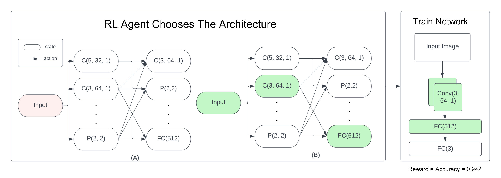

# Building Neural Networks using Deep Reinforcement Learning

### Contributors
- `Eshwar Prasad Sivaramakrishnan`: esivaram@usc.edu
- `Aditya Srivastava`: adityasr@usc.edu
- `Swarali Atul Joshi`: swaralia@usc.edu
- `Abhiruchi Bhattacharya`: abhiruch@usc.edu

# Introduction

This work is built to automate the design process for neural networks using reinforcement learning. Adopting prior design strategies and Deep Reinforcement Learning (DRL) techniques, we solve the MDP of constructing CNNs. Further, we use reward-shaping techniques to penalize large model sizes in order to urge agents to choose less complex CNNs without compromising on validation accuracy.

# Methodology

CNN as a Markovian Decision Process
We adopt the MDP representation for CNNs proposed
in [MetaQNN](https://bowenbaker.github.io/metaqnn/) (Baker et al., 2017) and adapt
it to fit our computation restrictions.

