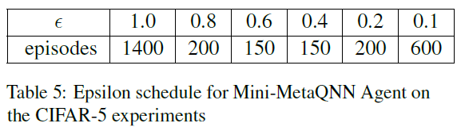
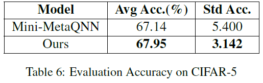
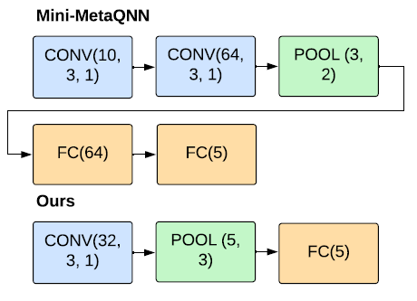
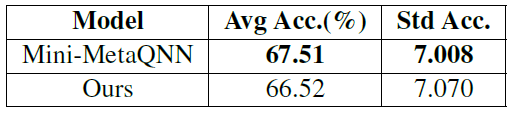
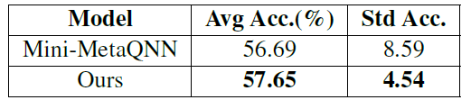

# Building Neural Networks using Deep Reinforcement Learning

### Contributors
- `Eshwar Prasad Sivaramakrishnan`: esivaram@usc.edu
- `Aditya Srivastava`: adityasr@usc.edu
- `Swarali Atul Joshi`: swaralia@usc.edu
- `Abhiruchi Bhattacharya`: abhiruch@usc.edu

# Introduction

This work is built to automate the design process for neural networks using reinforcement learning. Adopting prior design strategies and Deep Reinforcement Learning (DRL) techniques, we solve the MDP of constructing CNNs. Further, we use reward-shaping techniques to penalize large model sizes in order to urge agents to choose less complex CNNs without compromising on validation accuracy.

# Methodology

CNN as a Markovian Decision Process
We adopt the MDP representation for CNNs proposed
in [MetaQNN](https://bowenbaker.github.io/metaqnn/) (Baker et al., 2017) and adapt
it to fit our computation restrictions.

## The State Space
Each state in the MDP is a single layer represented
as a tuple with information about layer type, its
depth in the network and its associated hyperparameters.
Although the formulation is extensible
to all types of layers, we restrict our experiments
to convolution (’conv’), pooling (’pool’) and fully
connected (’fc’) layers.

## The Action Space
Actions are represented as similar tuples to states,
encapsulating information about the next layer to
be added. We manipulate the action space to restrict
possible actions from a given state to ensure
that sampled trajectories are always valid networks.

## Rewards
We consider two types of rewards to optimize for,
on reaching the terminal state:

  1. Accuracy: The CNN architecture represented
by the agent’s trajectory is trained on an image
classification problem and the validation accuracy
of this procedure is given to the agent
as terminal reward.

  2. Model Size Based Penalty: We also propose a minor
penalty to be deducted from the accuracy.
Penalty P for a given model with x trainable
parameters is calculated as:
P = β(δ · x + log(x))
where δ is a small constant (e−8) which preserves
linearity and β is a scale parameter,
normalizing the penalty to the same scale as
accuracy.

# Experimental Setup
## Dataset

To put into context our choice of datasets, it is noteworthy
to mention that the training of our RL agent
involves training several thousand CNNs. This restricts
the scope of our experiments, mainly due to
computation limitations.

## MDP Implementation
The CNN-MDP environment is designed with [OpenAI
Gym](https://www.gymlibrary.dev/) (Brockman et al., 2016). The states and
actions in the environment are designed as a tuple
of 7 discrete dimensions, as described in Table 1.
The environment uses invalid action masking to
present a binary mask (with 1’s representing valid
actions) to the agent at every timestep t.
At the end of every episode, the generated trajectory
is parsed as a CNN and is trained using
PyTorch. The resultant validation accuracy is returned
to the agent as the reward for the episode.
Hyperparameters for this training procedure are
listed in table 3.

## Reward-wise Experiments

As our pilot experiment, we chose to start experimentation
with MNIST-3. Results (table 4) shed
light on the intuition that more complex models do
not necessarily lead to better accuracy and that it
is possible to achieve comparable accuracy with
much smaller CNNs. This lead us to design two
new sets of experiments:

  1. The first setting
(without penalties), which will henceforth be addressed as
the CIFAR-5 Main Experiment

  2. With penalties, which will be
addressed as CIFAR-5 Penalized Experiment

## RL Methods and Implementation

### Q-Learning

For Mini-MetaQNN, we use the same learning rate
(α = 0.01) and discount factor (γ = 1) as in MetaQNN. The epsilon
schedule is described in table 5. We sample 30
replays from the replay memory at the end of every
episode to update Q-values.

### PPO

We make use of Stable-baselines3 framework 
to implement the PPO agent for
our method. We use num_steps = 64 as the update
frequency for PPO and run it until convergence for
every experiment. We use a learning rate of 0.0003,
batch size of 64, with an ϵ for clip range of 0.2.

## Results, Insights & Discussion

### CIFAR-5 Main Experiment

Once trained, we generate 50 models with
no Q-value or policy updates and report the mean
accuracy in table 6. We observe that our method
outperforms the baseline, with comparatively less
variance. Further, we visualize the network designed
by the ’optimal policy’ that each of the
agents converged at respectively in figure 4.

### CIFAR-5 Penalized Experiment

The main objective of this experiment is to assess
the effect of reward shaping strategies in the context
of building neural networks using RL. We drive our
focus towards the differences and improvements
of the results in terms model performance-model
complexity tradeoff.

In this experiment, we notice a significant improvement in terms of model complexity,
especially with the Mini-MetaQNN agent.
The mean of model size (in terms of number of
trainable parameters) dropped by two orders of
magnitude while maintaining similar ranges of accuracy
(tables 6 and 9). 

## CIFAR-10

As an extended study we choose to apply the main
experiment to the entirety of CIFAR-10 dataset.
Since this is a comparatively more complex classification
task with twice the size of data, we hold
tempered expectations for accuracy. Our method
outperforms the reproduced baseline by
a valid margin, with significantly less variance during
test time. 

## Limitations

- We highlight that the MDP implementation and
experiments are limited by the computational resources
available to us

- We limit the maximum
depth of a network to 8 (against 12 in the original
baseline), and the number of FC layers to 2.

- The MDP is restrictive by design, allowing
only for specific architectures to be created.
Owing to the lack of concepts such as skip connections,
ResNet-like networks cannot be created,
which may perform significantly better on image
classification tasks.

- Finally, designing specific MDPs and associated
rewards for different type of tasks is cumbersome,
from a practicality standpoint. We acknowledge
that, for practical purposes, one is better off relying
on conventional wisdom. We offer our ideas as
extensions to networks in research settings with
ample time and resources.

## FutureWork
There are several avenues for future research based
on environment restrictions to the search space,
some of which include: 

- Adding convolutional stride
as a configurable parameter and considering more diverse
layer types (e.g. global average pooling, attention),
allowing more FC layers per model and
consecutive pooling layers.

- The environment can also be extended by including
hyperparameters of the CNN training process
(learning rate, batch size, optimizer etc.) into the
search space.
- Another significant area of extension
is to allow different types of neural networks depending
upon the downstream task, such as RNNs
for sequential or time-series data and transformer
blocks for more complex tasks.

- Lastly, alternative
RL paradigms can be explored such as Deep QNetworks
to estimate a state-value function instead
of direct policy estimation.
